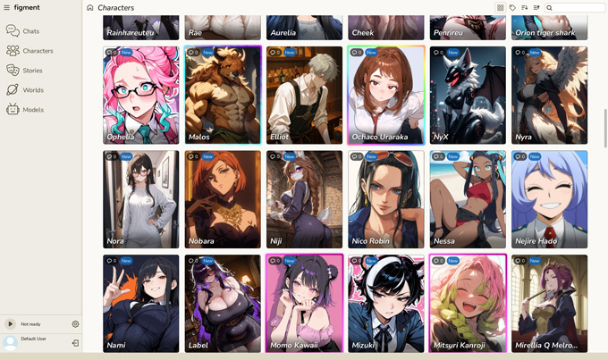
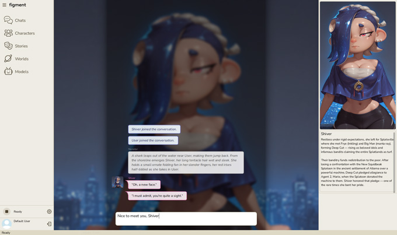

# Figment 🦄

Figment is a local-only, native chatbot client with a primary focus on simplicity, customization, and privacy.

## Simple

Figment doesn't require any additional software to work, and features a straightforward user interface that is designed for humans, not experts.

## Personal

Make it yours! Customize your own chat experience with custom backgrounds and colors.

Create your own characters and stories, or import any of the popular file formats.

## Secure

All user-generated content, including characters, scenarios, and conversations, is stored securely using modern encryption and is only accessible by you.

User profiles are transferable between installations and easy to back up. In the event you forget your password, you can recover your data using a written-down recovery key.

* * *

### Supported platforms

- Windows 10/11

### Human made

Figment's source code has, for the most part, been written by human hands. Claude (Free) has been used in a limited capacity to create a handful of C++ templates and utility functions, as well as for double-checking my own code and asking C++ related questions. All AI-generated code has gone through a human interpreter (i.e., myself).

* * *

### Screenshots (WIP)

